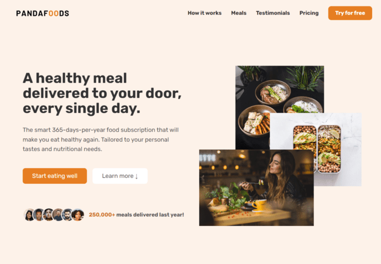
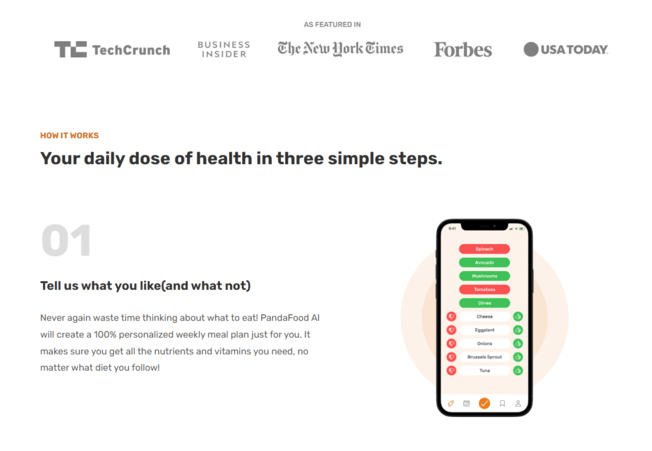
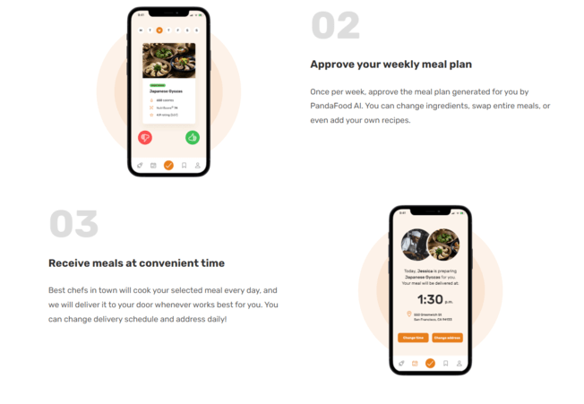
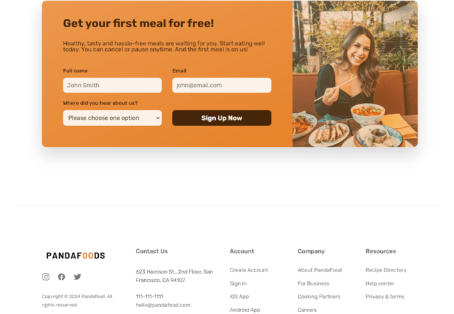
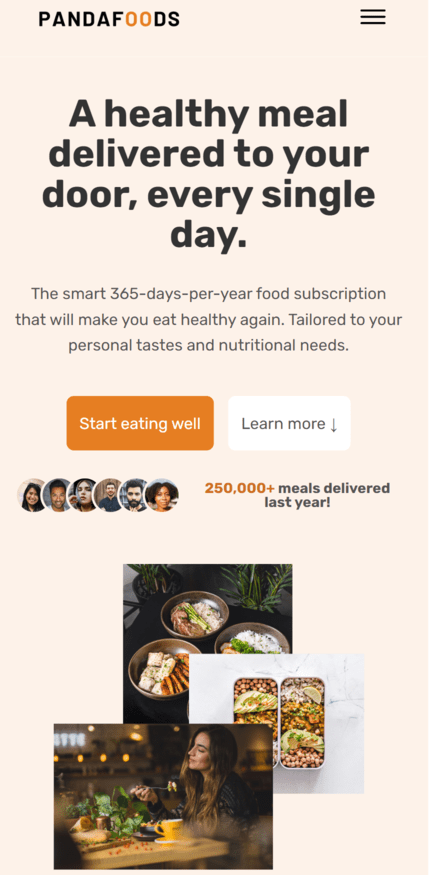
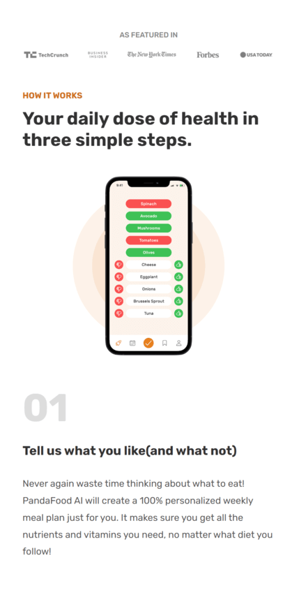
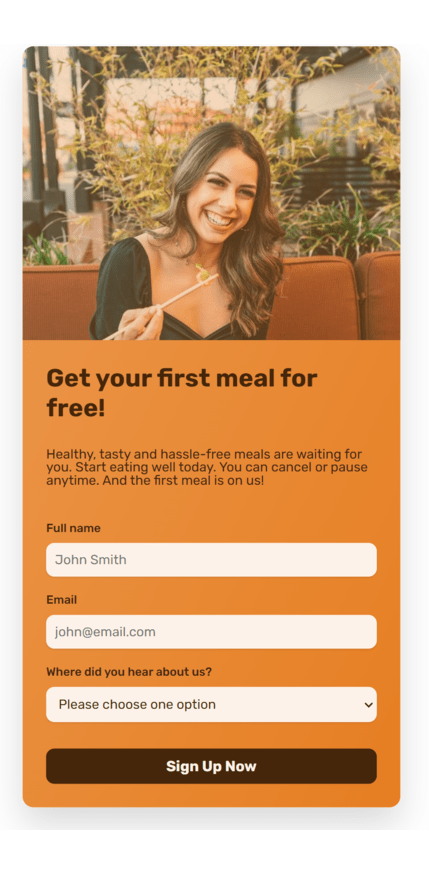
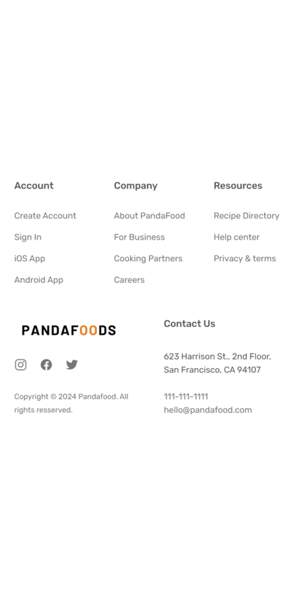

# Project Title

## Table of Contents

- [Overview](#overview)
- [Features](#features)
- [Technologies](#technologies)
- [Installation](#installation)
- [Useful URLs](#Useful-URLs)
- [Screenshots](#screenshots)
- [Contact](#contact)

## Overview

This project is a modern, responsive website designed to showcase various features and services of a fictional company. The layout and styling are implemented using HTML5 and CSS3, with a focus on creating a visually appealing and user-friendly interface.

## Features

List the key features of your project:

### 1. Global Styles

- Base styles to ensure a consistent look across different browsers.
- Custom fonts and color schemes for a cohesive design.

### 2. Reusable Components

- Button styles for primary and outline buttons with hover effects.
- Utility classes for margins and text headings.

### 3. Grid Layouts

- Flexible grid system with multiple column configurations (2, 3, 4, and 5 columns).
- Center alignment for vertical centering of grid items.

### 4. Responsive Design

- Media queries to ensure the layout adapts to various screen sizes, including desktops, tablets, and mobile devices.
- Mobile navigation menu with a toggle button for easy access on smaller screens.

### 5. Header and Navigation

- A sticky header with a logo and navigation links.
- Main navigation with hover effects and a call-to-action button.

### 6. Hero Section

- Prominent hero section with a large heading, description, and image.
- Delivered meals section showcasing customer images and testimonials.

### 7. Featured Section

- Display of trusted company logos in a horizontal layout.

### 8. How It Works Section

- Step-by-step illustration with images and descriptions.

### 9. Call to Action Section

- CTA with background image and gradient overlay.
- Form for user interaction with custom styling.

### 10. Footer Section

- Detailed footer with company information, social media links, and navigation.

## Technologies

Mention the main technologies used in your project:

- **HTML5** for the structure of the website.
- **CSS3** for styling and layout, including Flexbox and Grid for responsive design.
- **JavaScript** for implimenting opening and closing of hemburger menu.

## Installation

Provide step-by-step instructions on how to set up the project locally:

1. Clone the repository:

   ```sh
   git clone https://github.com/Deepanshu1337/css-project-PandaFood.git

   ```

2. Navigate to the project directory:
   cd yourproject

3. Open the index.html file in your browser or in live server inside vs code .

## Useful URLs

- **Solution URL:** [Github Repository](https://github.com/Deepanshu1337/css-project-PandaFood)
- **Live URL:** [Live site](https://deepanshu1337.github.io/css-project-PandaFood/)


### Desktop Design

|  |  |
|------------------------------------------------------|------------------------------------------------------|
|  |  |

### Mobile Design

|  |  |
|----------------------------------------------------|----------------------------------------------------|
|  |  |


## Contact

- **Email:** [deepanshudixit07@gmail.com](mailto:deepanshudixit07@gmail.com)
- **GitHub:** [Deepanshu1337](https://github.com/Deepanshu1337)
- **LinkedIn:** [Deepanshu Dixit](https://www.linkedin.com/in/deepanshudixit280/)
